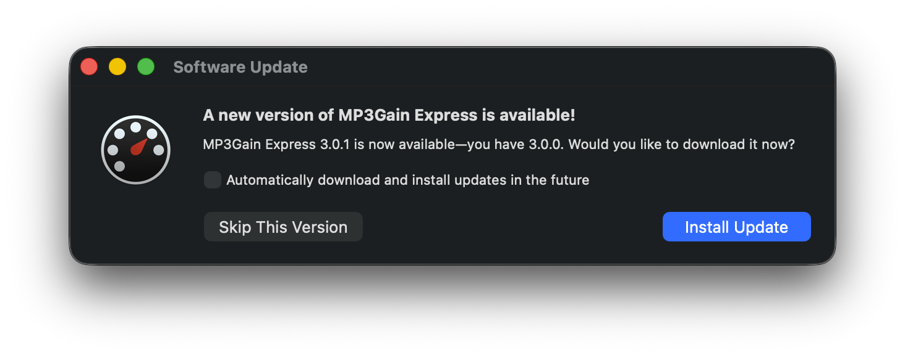
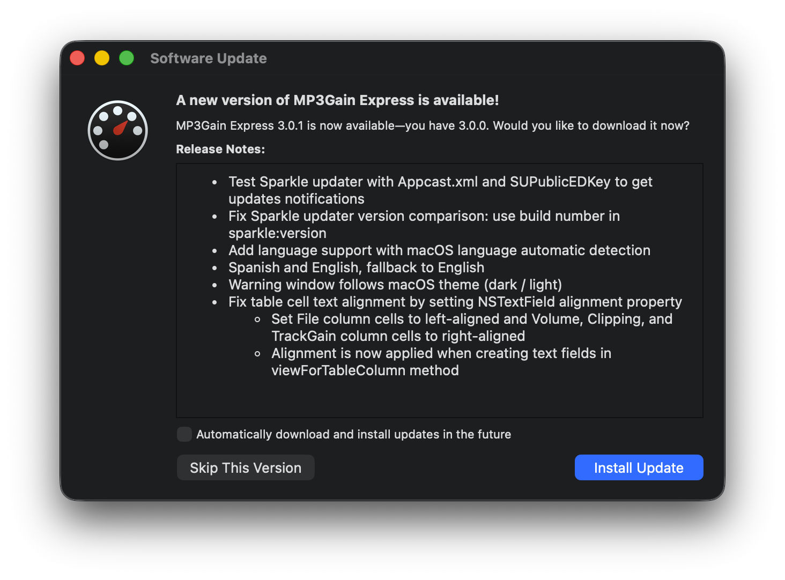

# Sparkle Updates Configuration

This document describes how to configure the Sparkle auto-update system in a GitHub repository containing a Xcode project.

## Overview

There is an example repository reository [MP3GainOSX-text](https://github.com/perez987/MP3GainOSX-test) that uses the Sparkle framework (version 1.24.0) to provide automatic updates, to complement the information in this how-to. The update feed is defined in the `appcast.xml` file located in the root of the repository.

## Generate keys

- Get a Sparkle distribution from the [releases](https://github.com/sparkle-project/Sparkle/releases) page
- Run `./generate_keys` (available in the `bin` folder in the Sparkle distribution root, this needs to be done only once):
	- it generates a private key that's saved in the login Keychain of the Mac 
	- it prints a public key to be embedded into the apps; write this key down for later use in the Xcode Info.plist file
	- run `./generate_keys` each time you need to see the public key again.

### Sign the app ZIP file

- Compress as ZIP the Xcode product intended to be uploaded as release to GitHub (e.g. MP3GainExpress.zip)
- Run `./sign_update MP3GainExpress.zip` (`sign_update` is available in the `bin` folder in the Sparkle distribution root)
- You get 2 data, write down for later use:
	- sparkle:edSignature -> a base64-encoded string to be added into the appcast.xml file
	- length -> ZIP file size in bytes.

## Configuration

### Info.plist Settings

Add the following keys in `MP3GainExpress/MP3GainExpress-Info.plist` to configure Sparkle:

- SUFeedURL: Points to the appcast XML file
  - Current value: `https://raw.githubusercontent.com/perez987/MP3GainOSX-test/main/appcast.xml`
  - Note: this link must point to `https://raw.githubusercontent.com`, not to `https://github.com`
- SUPublicEDKey: Public EdDSA key (previously noted) for verifying update signatures

```xml
	<key>SUFeedURL</key>
	<string>https://raw.githubusercontent.com/perez987/MP3GainOSX-test/main/appcast.xml</string>
	<key>SUPublicEDKey</key>
	<string>TYAEerTXwSU8wHwYzot2VEzwcPNeKLNQaTVSHkXV3vI=</string>
```

### Appcast File

The `appcast.xml` file follows the Sparkle RSS-based format:

```xml
<?xml version="1.0" encoding="utf-8"?>
<rss version="2.0" xmlns:sparkle="http://www.andymatuschak.org/xml-namespaces/sparkle" xmlns:dc="http://purl.org/dc/elements/1.1/">
    <channel>
        <link>https://github.com/perez987/MP3GainOSX-test</link>
        <language>en</language>
        <item>
            <title>Version 3.0.1</title>
            <description><![CDATA[
                <ul>
                    <li>Test Sparkle updater with Appcast.xml and SUPublicEDKey to get updates notifications</li>
                    <li>Fix Sparkle updater version comparison: use build number in sparkle:version</li>
                    <li>Add language support with macOS language automatic detection</li>
                    <li>Spanish and English, fallback to English</li>
                    <li>Warning window follows macOS theme (dark / light)</li>
                    <li>Fix table cell text alignment by setting NSTextField alignment property</li>
                    <ul>
                        <li>Set File column cells to left-aligned and Volume, Clipping, and TrackGain column cells to right-aligned</li>
                        <li>Alignment is now applied when creating text fields in viewForTableColumn method</li>
                    </ul>
            </ul>
            ]]></description>
            <pubDate>Mon, 17 Feb 2026 19:00:00 +0000</pubDate>
            <enclosure url="https://github.com/perez987/MP3GainOSX-test/releases/download/3.0.1/MP3GainExpress.zip"
                       sparkle:version="252"
                       sparkle:shortVersionString="3.0.1"
                       length="4342010"
                       sparkle:edSignature="NbZxXMJ02rcv0hr3okO0R6Anuonr1QBZTtsDrPxAxAzQWBLmmY0e6W9ha5sSC3PN8R8HVaHskl811m7bHJbqCw=="
                       type="application/octet-stream" />
            <sparkle:minimumSystemVersion>11.5</sparkle:minimumSystemVersion>
        </item>
    </channel>
</rss>
```
#### appcast.xml components:

- link: repository web address
- language: predefined language
- item: to set more than one release
- title: you can set the version number
- description empty: Sparkle displays a smaller update dialog, without version notes
   
- description with HTML text between CDATA tags: Sparkle displays a larger update dialog where we can see the release notes
      
- enclosure: version-specific data
	- url -> link to the app ZIP file
	- sparkle:version -> build number (`CURRENT_PROJECT_VERSION` = `CFBundleVersion`)
	- sparkle:shortVersionString-> human readable app version (`MARKETING_VERSION`)
	- length -> app ZIP file in bytes
	- sparkle:edSignature -> public EdDSA key for verifying update signatures
	- type -> "application/octet-stream"

#### appcast.xml localization

It is copied to the root of the repository.

## Publishing a New Release

When publishing a new release, follow these steps:

1. **Build the Application**
   
   - Build the app in Xcode using Release configuration
   - Save the application

2. **Create a ZIP File**
   
   - Compress the `.app` bundle: `zip -r MP3GainExpress.app.zip MP3GainExpress.app`
   - Note the file size in bytes: `ls -l MP3GainExpress.app.zip`.

3. **Sign the Update (Required for Security)**
   
   - Sparkle requires EdDSA signatures to verify update authenticity
   - Compress as ZIP the Xcode product intended to be uploaded as release to GitHub (e.g. MP3GainExpress.zip)
   - Run `./sign_update MP3GainExpress.zip` (`sign_update` is available in the `bin` folder in the Sparkle distribution root)
   - You get 2 data, write down for later use:
      - sparkle:edSignature -> a base64-encoded string to be added into the appcast.xml file
      - length -> ZIP file size in bytes.  

4. **Create GitHub Release**
   
   - Create a new release on GitHub with the version tag (e.g., `3.0.1`)
   - Upload the `MP3GainExpress.zip` file as a release asset
   - Add release notes describing the changes In relase page and in appcast.xml).

5. **Update appcast.xml**
   
   - Add a new `<item>` below `<language>` section
   - Update the version number, date, and download URL
   - Update the `length` attribute with the ZIP file size in bytes
   - Add the EdDSA signature to the `<enclosure>` tag.

6. **Commit and Push**
  
   - Commit the updated `appcast.xml` file
   - Push to the main branch
   - The app will now check for updates and find the new version.

### Testing with disabled signature verification (for development)

For testing purposes only, you can temporarily disable signature verification by removing the `SUPublicDSAKeyFile` key from `MP3GainExpress-Info.plist`. However, this is **not recommended** for production releases as it allows anyone to publish fake updates.

To test updates without EdDSA signature verification:

1. **Remove SUPublicEDKey from Info.plist** (if present):
  
   - Remove the `<key>SUPublicEDKey</key>` line and its corresponding `<string>...</string>` value
   - Or comment it out for easy restoration later.

2. **Ensure SUFeedURL uses raw.githubusercontent.com**:
  
   - Correct: `https://raw.githubusercontent.com/perez987/MP3GainOSX-2/main/appcast.xml`
   - Wrong: `https://github.com/perez987/MP3GainOSX-2/blob/main/appcast.xml`
   - The blob URL returns HTML, not XML, causing parsing errors.

3. **Remove EdDSA signature from appcast.xml** (if present):
   
   - The `sparkle:edSignature` attribute in the `<enclosure>` tag can be omitted when signature verification is disabled.

4. **Test the configuration**:
   
   - Build and run the app in Xcode
   - Select MP3Gain Express > Check for Updates...
   - The app should fetch and parse the feed successfully (though it may not show an update if versions match).

**Important**: Remember to re-enable signature verification before releasing to production by adding back the `SUPublicEDKey` key and including EdDSA signatures in the appcast.

### Testing with local file (for development)

1. **Get the full path to your appcast.xml:**
   
   ```bash
   cd /path/to/MP3GainOSX-test
   pwd
   # Copy the output, e.g., /Users/me/MP3GainOSX-test
   ```

2. **Temporarily edit Info.plist:**
   
   ```xml
   <key>SUFeedURL</key>
   <string>file:///Users/me/MP3GainOSX-test/appcast.xml</string>
   ```

3. **Build and test:**
   
   - Open MP3GainExpress.xcodeproj in Xcode
   - Build (⌘B)
   - Run (⌘R)
   - Select MP3Gain Express > Check for Updates....

4. **Expected result:**
   
   - You'll see a security warning (expected with file://) about "Auto-update not configured"
   - Click OK
   - You should then see either:
     - "You're up-to-date!" (if build version matches appcast)
     - "A new version is available" (if appcast version is higher)
     - "Update error" with signature verification failure (if signature is invalid).

5. **Remember to revert SUFeedURL** before committing.

## Important Notes

- Multiple versions can be listed in the appcast file (newest first)
- Sparkle will automatically determine if an update is available
- The version comparison uses semantic versioning
- Users can check for updates manually via the application menu: **MP3Gain Express > Check for Updates...**.

## Troubleshooting

### "Update error!" Dialog

If users see "An error occurred in retrieving update information", check:

1. The `appcast.xml` file is accessible at the URL specified in `SUFeedURL`
   - Common mistake: Using `https://github.com/.../blob/main/appcast.xml` instead of `https://raw.githubusercontent.com/.../main/appcast.xml`
   - The blob URL returns HTML (which causes "crossorigin attribute" errors), not the raw XML content
   - Always use the `raw.githubusercontent.com` URL for the feed
2. The XML is well-formed (no syntax errors)
3. The download URL in the `<enclosure>` tag is valid and accessible
4. The release asset exists on GitHub.

### EdDSA Signature Verification Failures

If signature verification fails:

1. Ensure the `SUPublicEDKey` value in Info.plist matches the public key from your key pair
2. Check that the `sparkle:edSignature` in the appcast matches the ZIP file signature
3. Verify you're using the correct attribute name: `sparkle:edSignature` (not `sparkle:dsaSignature`)
4. Make sure the signature was generated with the matching private key
5. Consider disabling signature verification during testing (not recommended for production).

## References

- [Sparkle Project](https://sparkle-project.org/)
- [Sparkle 1.x Documentation](https://sparkle-project.org/documentation/)
- [Creating an Appcast](https://sparkle-project.org/documentation/publishing/)
